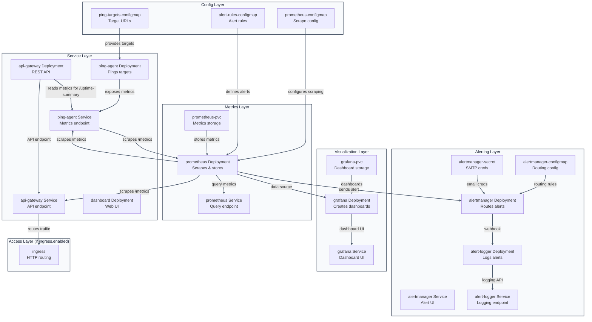

# UptimePulse Architecture & Template Map

This doc complements `README.md` with diagrams and a file-by-file map of the Helm chart. For quickstart/commands and service details, jump to [README.md](README.md). This doc is the architecture/map view.

## High-level flow (mermaid)
Runtime data/control flow. The Helm/deployment flow is shown in `README.md`.

```mermaid
flowchart LR
  linkStyle default stroke:#475569,stroke-width:2px
  classDef group fill:#f8fafc,stroke:#334155,stroke-width:2px,color:#0f172a
  classDef apiFlow stroke:#1d4ed8,stroke-width:2px
  classDef monitoringFlow stroke:#dc2626,stroke-width:2px
  classDef alertFlow stroke:#c2410c,stroke-width:2px
  classDef vizFlow stroke:#6d28d9,stroke-width:2px

  subgraph Access["Access Layer (if ingress.enabled)"]
    client((Client))
    ingress[Ingress<br/>HTTP routing]
  end

  subgraph Services["Service Layer"]
    apiSvc[api-gateway Service<br/>REST API]
    apiDep[api-gateway Deployment<br/>FastAPI server]
    pingSvc[ping-agent Service<br/>Metrics endpoint]
    pingDep[ping-agent Deployment<br/>Pings targets]
  end

  subgraph Observability["Observability Layer"]
    prom[Prometheus<br/>Metrics storage]
    grafana[Grafana<br/>Dashboards]
    am[Alertmanager<br/>Alert routing]
    logger[alert-logger<br/>Alert logging]
  end

  client -->|"HTTP request"| ingress -->|"routes to"| apiSvc -->|"serves"| apiDep
  apiDep -->|"reads metrics"| pingSvc -->|"exposes"| pingDep
  pingDep -->|"pings targets & exposes<br/>Prometheus metrics"| prom
  prom -->|"scrapes /metrics"| apiSvc
  prom -->|"visualizes data"| grafana
  prom -->|"sends alerts"| am -->|"logs alerts"| logger

  class Access,Services,Observability group
  linkStyle 0,1,2,3 apiFlow
  linkStyle 4,5 monitoringFlow
  linkStyle 6 vizFlow
  linkStyle 7,8 alertFlow
```

## Component roles and their templates
If a term is unfamiliar (ConfigMap, PVC, HPA, etc.), see the Dictionary section below.

| Component | What it does | Templates |
| --- | --- | --- |
| Ping Agent | Pings targets, exposes `/metrics` | `ping-agent-deployment.yaml`, `ping-agent-service.yaml`, `ping-targets-configmap.yaml` (ConfigMap; see Dictionary) |
| Prometheus | Scrapes metrics, stores data, evaluates alert rules | `prometheus-deployment.yaml`, `prometheus-service.yaml`, `prometheus-configmap.yaml` (ConfigMap), `prometheus-pvc.yaml` (PVC), `alert-rules-configmap.yaml` (ConfigMap) |
| Alertmanager | Receives alerts and routes them | `alertmanager-deployment.yaml` (Deployment), `alertmanager-service.yaml` (Service), `alertmanager-configmap.yaml` (ConfigMap), `alertmanager-secret.yaml` (Secret) |
| Alert Logger | Records all alerts | `alert-logger-deployment.yaml` (Deployment), `alert-logger-service.yaml` (Service) |
| API Gateway | REST API over metrics | `api-gateway-deployment.yaml` (Deployment), `api-gateway-service.yaml` (Service) |
| Grafana | Dashboards | `grafana-deployment.yaml` (Deployment), `grafana-service.yaml` (Service), `grafana-pvc.yaml` (PVC) |
| Dashboard UI | Web UI | `dashboard-deployment.yaml` (Deployment) |
| Ingress | External entrypoint | `ingress.yaml` (Ingress; see Dictionary) |
| HPA | Auto-scaling (if hpa.enabled) | `hpa.yaml` (HPA; see Dictionary) |
| Shared helpers | Naming/label helpers | `_helpers.tpl` |

## Dictionary (terms used in this doc)
- **ConfigMap**: Key/value config mounted into pods (e.g., `ping-targets-configmap`, `prometheus-configmap`).
- **Secret**: Like a ConfigMap, but for sensitive values (e.g., `alertmanager-secret`).
- **PVC (PersistentVolumeClaim)**: Storage request for durable data (e.g., Prometheus + Grafana storage).
- **HPA (Horizontal Pod Autoscaler)**: Scales replicas based on metrics (CPU in this repo).
- **Deployment**: Manages pod replicas and rollouts for a service.
- **Service**: Stable DNS + load‑balancing over pods.
- **Ingress**: HTTP entrypoint that routes host/path → Service (needs an Ingress controller).
- **Helm chart**: Parameterized packaging for all Kubernetes resources in `charts/uptimepulse`.

## Who produces what (and who consumes it)
Terms in **bold** here map to the Dictionary section below.
### Producers
- `ping-agent` produces Prometheus metrics at `/metrics`.
- `api-gateway` produces its own metrics at `/metrics` and JSON at `/uptime-summary`.

### Consumers
- `Prometheus` consumes `/metrics` from `ping-agent` and `api-gateway`.
- `Grafana` consumes time‑series data from Prometheus.
- `api-gateway` consumes `ping-agent /metrics` to compute `/uptime-summary`.
- `Alertmanager` consumes alerts from Prometheus.
- `alert-logger` consumes webhook alerts from Alertmanager.

### Config / inputs
- `ping-targets-configmap` feeds `ping-agent` via `/config/targets.json`.
- `prometheus-configmap` feeds Prometheus (scrape config).
- `alert-rules-configmap` feeds Prometheus (alert expressions).
- `alertmanager-configmap` feeds Alertmanager (routing).
- `alertmanager-secret` feeds Alertmanager (SMTP creds).
- `grafana-pvc` feeds Grafana (dashboards/users).
- `prometheus-pvc` feeds Prometheus (metrics history).

## End-to-end data path (mermaid)

## Mini “how Helm renders templates” (quick reference)

- `define "uptimepulse.labels"`: creates a reusable template in `_helpers.tpl`.
- `include "uptimepulse.labels" .`: calls that template and passes the current context (`.`).
- `nindent X`: adds a newline and indents the rendered block by `X` spaces so YAML stays valid.
- Example (from `alert-logger-deployment.yaml`):
  - We include labels via `include "uptimepulse.labels" . | nindent 4`.
  - Helm replaces it with the three standard labels, indented 4 spaces.
  - The file then adds `app.kubernetes.io/component: alert-logger` as a fourth label.

## Component-by-component flows (concise)

- **Ping Agent**: `ping-targets-configmap` → mounted into `ping-agent-deployment` → exposed via `ping-agent-service`.
- **Prometheus**: `prometheus-configmap` + `alert-rules-configmap` + `prometheus-pvc` → mounted into `prometheus-deployment` → UI via `prometheus-service`.
- **Alertmanager**: `alertmanager-configmap` + `alertmanager-secret` → mounted into `alertmanager-deployment` → UI via `alertmanager-service` → can forward to `alert-logger`.
- **Alert Logger**: `alert-logger-deployment` logs alerts → reachable via `alert-logger-service`.
- **API Gateway**: `api-gateway-deployment` (FastAPI) → `api-gateway-service` → ingress (if enabled).
- **Grafana**: `grafana-pvc` → `grafana-deployment` → `grafana-service`.
- **Dashboard UI**: `dashboard-deployment` (optionally fronted by ingress via API gateway).
- **Ingress**: `ingress.yaml` routes external HTTP to `api-gateway-service` (only when enabled in values).
- **HPA**: `hpa.yaml` defines autoscaling rules (inactive unless enabled in values).

## Logical deployment order (Helm handles it, but for understanding)

1) ConfigMaps & Secrets → 2) PVCs → 3) Deployments → 4) Services → 5) Ingress → 6) HPA

## If you’re scanning this doc quickly

- Need the big picture? Check the two mermaid diagrams above.
- Need to know what a specific file does? Use the table under “Component roles and their templates”.
- Need Helm templating tips? See “Mini how Helm renders templates”.
