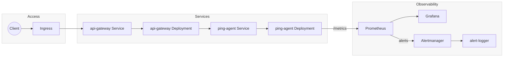
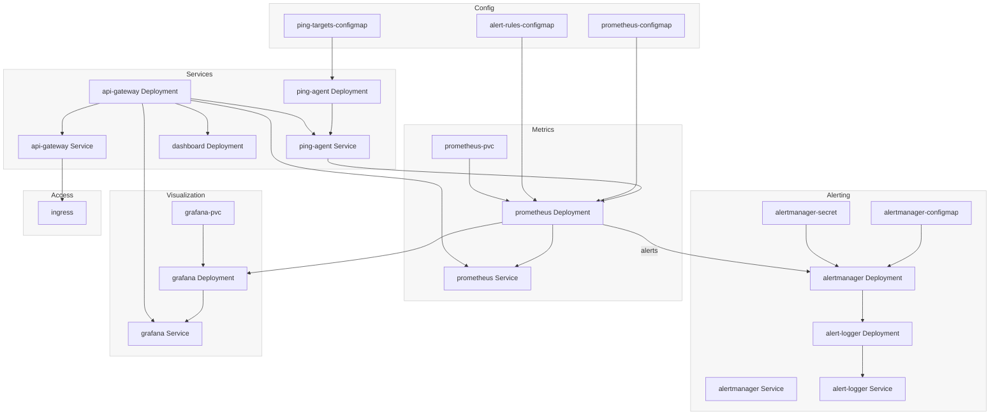

# UptimePulse Architecture & Template Map

This doc complements `README.md` with diagrams and a file-by-file map of the Helm chart. For quickstart/commands and service details, jump to [README.md](README.md). This doc is the architecture/map view.

## High-level flow (mermaid)

## Component roles and their templates

| Component | What it does | Templates |
| --- | --- | --- |
| Ping Agent | Pings targets, exposes `/metrics` | `ping-agent-deployment.yaml`, `ping-agent-service.yaml`, `ping-targets-configmap.yaml` |
| Prometheus | Scrapes metrics, stores data, evaluates alert rules | `prometheus-deployment.yaml`, `prometheus-service.yaml`, `prometheus-configmap.yaml`, `prometheus-pvc.yaml`, `alert-rules-configmap.yaml` |
| Alertmanager | Receives alerts and routes them | `alertmanager-deployment.yaml`, `alertmanager-service.yaml`, `alertmanager-configmap.yaml`, `alertmanager-secret.yaml` |
| Alert Logger | Records all alerts | `alert-logger-deployment.yaml`, `alert-logger-service.yaml` |
| API Gateway | REST API over metrics | `api-gateway-deployment.yaml`, `api-gateway-service.yaml` |
| Grafana | Dashboards | `grafana-deployment.yaml`, `grafana-service.yaml`, `grafana-pvc.yaml` |
| Dashboard UI | Web UI | `dashboard-deployment.yaml` |
| Ingress | External entrypoint | `ingress.yaml` (gates traffic to api-gateway) |
| HPA | Auto-scaling | `hpa.yaml` |
| Shared helpers | Naming/label helpers | `_helpers.tpl` |

## End-to-end data path (mermaid)

## Mini “how Helm renders templates” (quick reference)

- `define "uptimepulse.labels"`: creates a reusable template in `_helpers.tpl`.
- `include "uptimepulse.labels" .`: calls that template and passes the current context (`.`).
- `nindent X`: adds a newline and indents the rendered block by `X` spaces so YAML stays valid.
- Example (from `alert-logger-deployment.yaml`):
  - We include labels via `include "uptimepulse.labels" . | nindent 4`.
  - Helm replaces it with the three standard labels, indented 4 spaces.
  - The file then adds `app.kubernetes.io/component: alert-logger` as a fourth label.

## Component-by-component flows (concise)

- **Ping Agent**: `ping-targets-configmap` → mounted into `ping-agent-deployment` → exposed via `ping-agent-service`.
- **Prometheus**: `prometheus-configmap` + `alert-rules-configmap` + `prometheus-pvc` → mounted into `prometheus-deployment` → UI via `prometheus-service`.
- **Alertmanager**: `alertmanager-configmap` + `alertmanager-secret` → mounted into `alertmanager-deployment` → UI via `alertmanager-service` → can forward to `alert-logger`.
- **Alert Logger**: `alert-logger-deployment` logs alerts → reachable via `alert-logger-service`.
- **API Gateway**: `api-gateway-deployment` (FastAPI) → `api-gateway-service` → ingress (if enabled).
- **Grafana**: `grafana-pvc` → `grafana-deployment` → `grafana-service`.
- **Dashboard UI**: `dashboard-deployment` (optionally fronted by ingress via API gateway).
- **Ingress**: `ingress.yaml` routes external HTTP to `api-gateway-service` (only when enabled in values).
- **HPA**: `hpa.yaml` defines autoscaling rules (inactive unless enabled in values).

## Logical deployment order (Helm handles it, but for understanding)

1) ConfigMaps & Secrets → 2) PVCs → 3) Deployments → 4) Services → 5) Ingress → 6) HPA

## If you’re scanning this doc quickly

- Need the big picture? Check the two mermaid diagrams above.
- Need to know what a specific file does? Use the table under “Component roles and their templates”.
- Need Helm templating tips? See “Mini how Helm renders templates”.
