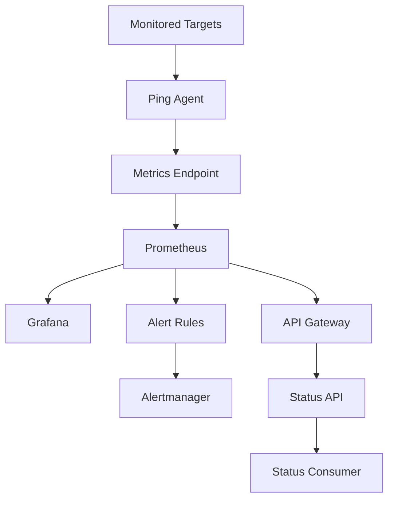
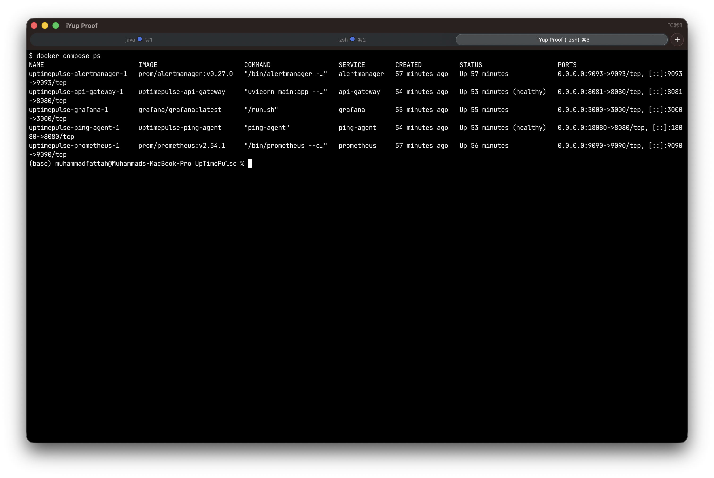
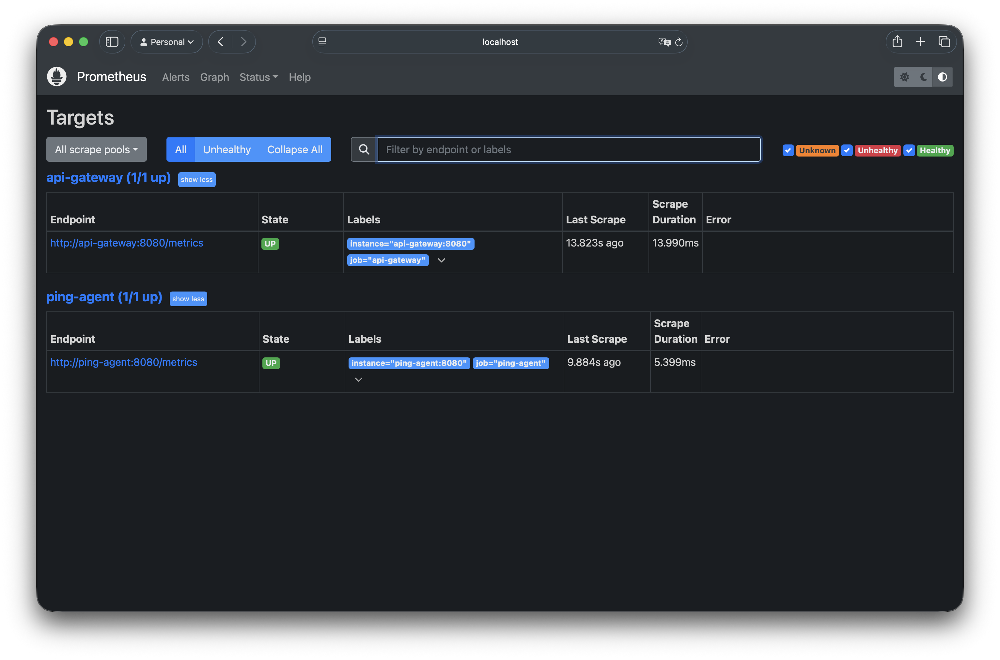
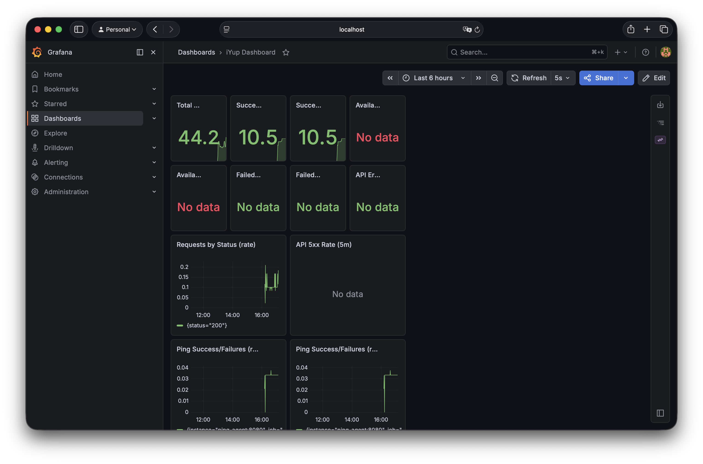

# iYup


iYup is a self-hosted uptime and latency monitoring lab built to demonstrate SRE and platform engineering fundamentals: active health checks, Prometheus metrics, Grafana dashboards, alert routing, Docker Compose deployment, and Kubernetes packaging.

It is not a managed observability SaaS clone. The goal is to show how service reliability signals move from endpoint checks into metrics, dashboards, API responses, and alerts.

## Run It Locally

```bash
cp .env.example .env
docker compose up -d
./scripts/verify-local.sh
```

Then open:

- API: `http://localhost:8080/status`
- Prometheus: `http://localhost:9090/targets`
- Grafana: `http://localhost:3000`
- Alertmanager: `http://localhost:9093`

If you change ports in `.env`, use those values below.

## What Works

- active HTTP checks from `ping-agent`
- JSON status reporting from `api-gateway`
- Prometheus metrics from both services
- local Docker Compose startup with health-gated dependencies
- Grafana datasource and dashboard provisioning in Docker Compose
- Prometheus alert rules with an Alertmanager routing path
- Helm chart rendering for Kubernetes packaging

## System Flow


```mermaid
flowchart TD
    A[Monitored Targets] --> B[Ping Agent]
    B --> C[Metrics Endpoint]
    C --> D[Prometheus]
    D --> E[Grafana]
    D --> F[Alert Rules]
    F --> G[Alertmanager]
    D --> H[API Gateway]
    H --> I[Status API]
    I --> J[Status Consumer]
```

## Verification

```bash
./scripts/verify-local.sh
```

The script:

- validates `docker compose config`
- starts the local stack
- waits for API readiness
- checks `/healthz`, `/status`, `/targets`, and `/metrics`
- checks Prometheus readiness
- checks Grafana and Alertmanager availability when those services are in Compose

Phase 0 command logs and outcomes are in [docs/PHASE_0_VERIFICATION.md](docs/PHASE_0_VERIFICATION.md).

## What This Proves for SRE / Platform Roles

- active HTTP health checks against configurable targets
- Prometheus metric exposure from the checker and the API layer
- API status reporting for external consumers
- latency visibility through last-value and percentile summaries
- availability visibility through counters and Prometheus-backed windows
- Grafana dashboard provisioning in local Docker Compose
- alert routing path from Prometheus rules to Alertmanager
- Docker Compose local operation with repeatable startup checks
- Helm and Kubernetes manifest validation through lint and template rendering
- local verification script you can rerun

## API Surface

| Endpoint | Purpose |
|---|---|
| `GET /healthz` | API health check |
| `GET /status` | Current target status, last latency, percentiles, and availability |
| `GET /targets` | Target list derived from `PING_TARGET_URLS` |
| `GET /targets/{url}` | Per-target details, including latency percentiles |
| `GET /uptime-summary` | Lifetime success, failure, and availability from ping-agent counters |
| `GET /uptime-summary-windowed?window=5m` | Windowed availability from Prometheus queries |
| `GET /metrics` | Prometheus metrics for the API gateway |

`/uptime-summary-windowed` uses Prometheus `increase()`, so short windows can return fractional success and failure values.

## Demo Screenshots

The screenshots live in [`docs/screenshots/`](docs/screenshots/). The capture checklist is in [docs/SCREENSHOT_GUIDE.md](docs/SCREENSHOT_GUIDE.md).

Key previews:





Full set:

- [01 repo overview](docs/screenshots/01-repo-overview.png)
- [02 Docker Compose stack](docs/screenshots/02-docker-compose-stack.png)
- [03 API health check](docs/screenshots/03-api-healthz.png)
- [04 API status response](docs/screenshots/04-api-status-response.png)
- [05 Prometheus targets](docs/screenshots/05-prometheus-targets.png)
- [06 Prometheus metrics query](docs/screenshots/06-prometheus-metrics.png)
- [07 Grafana dashboard](docs/screenshots/07-grafana-dashboard.png)
- [08 Alertmanager page](docs/screenshots/08-alertmanager.png)
- [09 Helm template output](docs/screenshots/09-helm-template.png)
- [10 local verification script](docs/screenshots/10-local-verification.png)

## Configuration

| Variable | Default | Purpose |
|---|---|---|
| `PING_TARGET_URLS` | `https://google.com,https://github.com` | Comma-separated target URLs |
| `PING_INTERVAL_SECONDS` | `30` | Ping cadence |
| `PING_CONCURRENCY` | `5` | Parallel ping workers |
| `PING_RETRY_COUNT` | `2` | Additional ping retries before marking a target down |
| `PING_HTTP_METHOD` | `GET` | Request method |
| `PING_RANGE_REQUEST` | `true` | Sends `Range: bytes=0-0` on `GET` requests |
| `PROMETHEUS_QUERY_CACHE_SECONDS` | `15` | API cache TTL for Prometheus-backed window queries |
| `PING_AGENT_PORT` | `18080` | Host port for ping-agent metrics |
| `API_GATEWAY_PORT` | `8080` | Host port for the API gateway |
| `PROMETHEUS_PORT` | `9090` | Host port for Prometheus |
| `GRAFANA_PORT` | `3000` | Host port for Grafana |
| `ALERTMANAGER_PORT` | `9093` | Host port for Alertmanager |
| `GRAFANA_PASSWORD` | `admin` | Grafana admin password for Docker Compose |
| `PROMETHEUS_RETENTION` | `14d` | Prometheus retention period |

## Limitations

- does not replace managed observability platforms
- does not provide distributed tracing
- does not provide log aggregation
- does not guarantee production-grade alert tuning
- does not include real notification credentials
- does not implement incident management workflows
- not multi-region
- Helm rendering is validated, but no live Kubernetes cluster behavior is claimed here

## Project Layout

```text
iYup/
├── services/
│   ├── ping-agent/
│   └── api-gateway/
├── config/
├── monitoring/
├── charts/iyup/
├── scripts/
└── docs/
```

## Documentation

- [docs/PHASE_0_VERIFICATION.md](docs/PHASE_0_VERIFICATION.md)
- [docs/SCREENSHOT_GUIDE.md](docs/SCREENSHOT_GUIDE.md)
- [docs/RELIABILITY_SCENARIOS.md](docs/RELIABILITY_SCENARIOS.md)
- [docs/OPERATIONS_RUNBOOK.md](docs/OPERATIONS_RUNBOOK.md)
- [docs/QUICKSTART.md](docs/QUICKSTART.md)
- [docs/API.md](docs/API.md)
- [docs/ARCHITECTURE.md](docs/ARCHITECTURE.md)
- [docs/DEPLOYMENT.md](docs/DEPLOYMENT.md)
- [docs/GRAFANA.md](docs/GRAFANA.md)
- [docs/TROUBLESHOOTING.md](docs/TROUBLESHOOTING.md)
