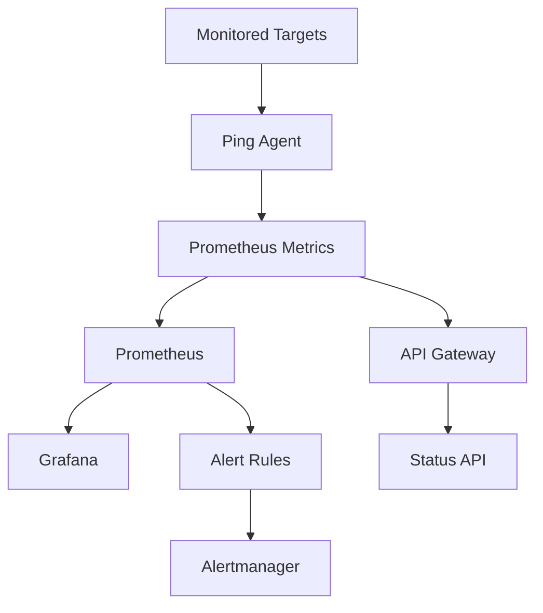

# iYup

I built iYup to show how a small monitoring stack fits together: active checks, Prometheus scraping, Grafana dashboards, Alertmanager wiring, a status API, Docker Compose, and Helm packaging.

It is not a SaaS clone. It is a small lab with real commands, real screenshots, and a verification path that can be rerun locally.

## What It Proves

- active HTTP checks from `ping-agent`
- Prometheus metrics from `ping-agent` and `api-gateway`
- status and target APIs over live monitoring data
- latency percentiles and windowed uptime summaries
- Grafana dashboard provisioning in Docker Compose
- Alertmanager wiring from Prometheus rules
- local Docker Compose startup and Helm render checks

## Run It Locally

```bash
cp .env.example .env
docker compose up -d
./scripts/verify-local.sh
```

Open:

- API: `http://localhost:8080/status`
- Prometheus: `http://localhost:9090/targets`
- Grafana: `http://localhost:3000`
- Alertmanager: `http://localhost:9093`

If `.env` overrides host ports, use those values instead. The copyable commands are in [docs/DEMO_COMMANDS.md](docs/DEMO_COMMANDS.md).

## System Flow


```mermaid
flowchart TD
    A[Monitored Targets] --> B[Ping Agent]
    B --> C[Prometheus Metrics]
    C --> D[Prometheus]
    D --> E[Grafana]
    D --> F[Alert Rules]
    F --> G[Alertmanager]
    C --> H[API Gateway]
    H --> I[Status API]
```

## Verification

Run:

```bash
./scripts/verify-local.sh
```

Phase 0 command logs are in [docs/PHASE_0_VERIFICATION.md](docs/PHASE_0_VERIFICATION.md).

The current proof status is in [docs/PORTFOLIO_PROOF_CHECKLIST.md](docs/PORTFOLIO_PROOF_CHECKLIST.md).

## Demo Screenshots

The screenshots live in [`docs/screenshots/`](docs/screenshots/). The capture commands are in [docs/SCREENSHOT_GUIDE.md](docs/SCREENSHOT_GUIDE.md).


Full set:

- [01 repo overview](docs/screenshots/01-repo-overview.png)
- [02 Docker Compose stack](docs/screenshots/02-docker-compose-stack.png)
- [03 API health check](docs/screenshots/03-api-healthz.png)
- [04 API status response](docs/screenshots/04-api-status-response.png)
- [05 Prometheus targets](docs/screenshots/05-prometheus-targets.png)
- [06 Prometheus metrics query](docs/screenshots/06-prometheus-metrics.png)
- [07 Grafana dashboard](docs/screenshots/07-grafana-dashboard.png)
- [08 Alertmanager page](docs/screenshots/08-alertmanager.png)
- [09 Helm template output](docs/screenshots/09-helm-template.png)
- [10 local verification script](docs/screenshots/10-local-verification.png)

## API Surface

| Endpoint | Purpose |
|---|---|
| `GET /healthz` | API health check |
| `GET /targets` | configured target list |
| `GET /status` | current status, latency, percentiles, and availability |
| `GET /targets/{url}` | per-target detail |
| `GET /uptime-summary` | lifetime success, failure, and availability |
| `GET /uptime-summary-windowed?window=5m` | Prometheus-backed uptime window |
| `GET /metrics` | Prometheus metrics for the API gateway |

## Configuration

| Variable | Default | Purpose |
|---|---|---|
| `PING_TARGET_URLS` | `https://google.com,https://github.com` | comma-separated targets |
| `PING_INTERVAL_SECONDS` | `30` | check cadence |
| `PING_CONCURRENCY` | `5` | parallel workers |
| `PING_RETRY_COUNT` | `2` | retries before down |
| `PROMETHEUS_QUERY_CACHE_SECONDS` | `15` | cache TTL for windowed queries |
| `API_GATEWAY_PORT` | `8080` | API host port |
| `PING_AGENT_PORT` | `18080` | ping-agent host port |
| `PROMETHEUS_PORT` | `9090` | Prometheus host port |
| `GRAFANA_PORT` | `3000` | Grafana host port |
| `ALERTMANAGER_PORT` | `9093` | Alertmanager host port |
| `GRAFANA_PASSWORD` | `admin` | Grafana admin password in Docker Compose |

## Limitations

- no distributed tracing
- no log aggregation
- no real notification credentials
- no incident workflow tooling
- no multi-region behavior
- Helm is render-validated here, not cluster-validated

## Docs

- [docs/QUICKSTART.md](docs/QUICKSTART.md)
- [docs/API.md](docs/API.md)
- [docs/ARCHITECTURE.md](docs/ARCHITECTURE.md)
- [docs/DEPLOYMENT.md](docs/DEPLOYMENT.md)
- [docs/GRAFANA.md](docs/GRAFANA.md)
- [docs/OPERATIONS_RUNBOOK.md](docs/OPERATIONS_RUNBOOK.md)
- [docs/TROUBLESHOOTING.md](docs/TROUBLESHOOTING.md)
- [docs/PHASE_0_VERIFICATION.md](docs/PHASE_0_VERIFICATION.md)
- [docs/SCREENSHOT_GUIDE.md](docs/SCREENSHOT_GUIDE.md)
- [docs/PORTFOLIO_PROOF_CHECKLIST.md](docs/PORTFOLIO_PROOF_CHECKLIST.md)
- [docs/DEMO_COMMANDS.md](docs/DEMO_COMMANDS.md)
- [docs/RELIABILITY_SCENARIOS.md](docs/RELIABILITY_SCENARIOS.md)
