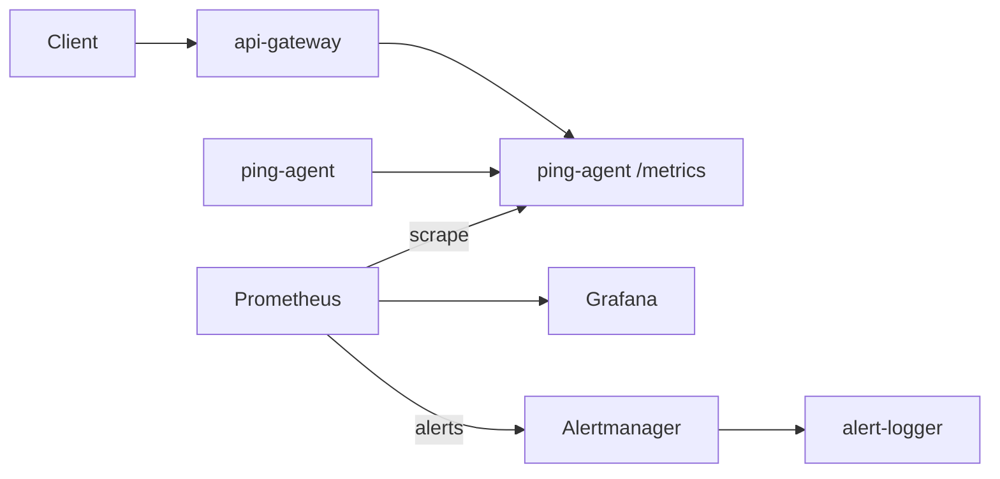

# UptimePulse


Lightweight uptime + latency stack for learning Kubernetes, Prometheus, and real‑world SRE workflows — no cloud lock‑in, no managed magic.

## Table of Contents

- [Architecture overview](#architecture-overview)
- [Project layout](#project-layout)
- [Quickstart (local Docker)](#quickstart-local-docker)
- [Quickstart (Minikube)](#quickstart-minikube)
- [API Gateway Quickstart](#api-gateway-fastapi-quickstart)
- [API Endpoints](#api-endpoints-what-they-actually-do)
- [Command Notes](#command-notes)
- [Flag Cheat Sheet](#flag-cheat-sheet)
- [Why These Pieces Exist](#why-these-pieces-exist)
- [Metrics Cheat Sheet](#metrics-cheat-sheet)
- [Grafana Dashboard](#grafana-dashboard-what-it-shows-and-how-to-wire-it-up)
- [Troubleshooting](#troubleshooting-notes)
- [Rebuild From Scratch](#rebuild-everything-from-scratch)
- [What I Learned](#what-i-learned-and-why-this-exists)

## Architecture overview
Here’s the quick mental model:

`ping-agent` pings a URL and exposes `/metrics`. Prometheus scrapes it (and `api-gateway`), stores time‑series data, and Grafana draws the graphs. The `api-gateway` reads ping‑agent metrics and exposes JSON summaries so a client doesn’t have to read raw Prometheus text. Alerts go through Alertmanager and land in a tiny logger service for now.

Data path: `ping-agent` → `Prometheus` → `Grafana`  
API path: `client` → `api-gateway` → `ping-agent` metrics



## Project layout
- `services/` contains the application services (ping-agent, api-gateway, dashboard-ui).
- `k8s/` contains Kubernetes manifests used to run everything in a cluster.
- `ci-cd/` contains legacy CI/CD pipeline configuration (kept for reference).
- `.github/workflows/` is the active CI workflow location.
- `monitoring/` contains Prometheus (metrics collection) and Grafana (dashboards).
- `terraform/` contains infrastructure as code to provision cloud resources.
- `docs/` removed (the root `README.md` is the single source of truth).

## Quickstart (local Docker)
Run ping‑agent locally:

```
cd services/ping-agent
docker build -t ping-agent:dev .
docker run --rm ping-agent:dev
```

## Quickstart (Minikube)
Ping‑agent in Minikube:

```
minikube start
kubectl config use-context minikube
eval $(minikube -p minikube docker-env)
docker build -t ping-agent:latest services/ping-agent
kubectl apply -f k8s/ping-agent-deployment.yaml
kubectl rollout restart deployment ping-agent
kubectl rollout status deployment ping-agent
kubectl port-forward deploy/ping-agent 18080:8080
```

In another terminal:

```
curl -v http://localhost:18080/metrics
```

For the command explanations, jump to [Command Notes](#command-notes) and [Flag Cheat Sheet](#flag-cheat-sheet).

## API Gateway (FastAPI) Quickstart
Build and run the API gateway in Minikube:

```
eval $(minikube -p minikube docker-env)
docker build -t api-gateway:latest services/api-gateway
kubectl apply -f k8s/api-gateway-deployment.yaml
kubectl apply -f k8s/api-gateway-service.yaml
kubectl rollout restart deployment api-gateway
kubectl rollout status deployment api-gateway
kubectl port-forward svc/api-gateway 8080:8080
```

Test it:

```
curl -v http://localhost:8080/healthz
```

Note: `api-gateway` uses `imagePullPolicy: IfNotPresent`. Build inside Minikube or it won’t find the image. (Ask me how I know.)

What each command means:
- `eval $(minikube -p minikube docker-env)` points Docker at Minikube's Docker daemon.
- `docker build -t api-gateway:latest services/api-gateway` builds the image inside Minikube.
- `kubectl apply -f k8s/api-gateway-deployment.yaml` creates/updates the Deployment.
- `kubectl apply -f k8s/api-gateway-service.yaml` creates/updates the Service.
- `kubectl rollout restart deployment api-gateway` restarts pods to pick up the new image.
- `kubectl rollout status deployment api-gateway` waits for the Deployment to become ready.
- `kubectl port-forward svc/api-gateway 8080:8080` tunnels local port `8080` to the Service.

## API Endpoints (What They Actually Do)
Endpoints from `api-gateway`:

- `GET /healthz` → simple healthcheck.
- `GET /targets` → list monitored URLs (from `PING_TARGET_URLS`).
- `GET /uptime-summary` → success/failure counts + availability %.
- `GET /metrics` → Prometheus metrics for api‑gateway itself.

## Command Notes
Short explanations of the commands used above.

### Minikube and kubectl
- `minikube start` starts a local Kubernetes cluster.
- `kubectl config use-context minikube` points `kubectl` at that cluster.
- `eval $(minikube -p minikube docker-env)` points Docker at Minikube's Docker daemon.
- `kubectl apply -f k8s/ping-agent-deployment.yaml` creates or updates resources from a file.
- `kubectl rollout restart deployment ping-agent` restarts pods to pick up new images/config.
- `kubectl port-forward deploy/ping-agent 18080:8080` tunnels a pod port to your machine.  
  If the pod is restarting, run `kubectl rollout status deployment ping-agent` and try again.

### Docker
- `docker build -t ping-agent:dev .` builds and tags an image from the current directory.
- `docker run --rm ping-agent:dev` runs the image and deletes the container after exit.
- `docker ps` lists running containers.
- `docker ps -a` lists all containers, including stopped.
- `docker images` lists local images.
- `docker stop <container>` stops a running container.

### Curl
- `curl -v http://localhost:18080/metrics` sends an HTTP request and shows verbose output.

## Flag Cheat Sheet
Common flags used in this project:

- `-f` = read from file (used by `kubectl`)
- `-v` = verbose output (used by `curl`)
- `-t` = tag name (used by `docker build`)
- `-p` = profile name (used by `minikube`)
- `--rm` = remove container after exit (used by `docker run`)

## Why these pieces exist
### Metrics producer (ping-agent)
This is the heart of the system. If this isn’t running, everything else is just watching silence. It pings a URL, then exposes:
- counters (`ping_success_total`, `ping_failure_total`)
- histogram (`ping_latency_seconds`)
- `/metrics` for scraping
- targets come from `PING_TARGET_URLS` (comma‑separated)

Without this, there’s nothing to observe.

### Metrics collection (Prometheus)
Prometheus pulls `/metrics` every 15s and stores the history. That’s the difference between “I can see a number now” and “I can graph the last 24 hours.”

Retention/storage notes:
- Retention is set to `14d` via `--storage.tsdb.retention.time=14d` in `k8s/prometheus-deployment.yaml`.
- PVC size is `5Gi` in `k8s/prometheus-pvc.yaml`.
- Prometheus storage docs: [https://prometheus.io/docs/prometheus/latest/storage/](https://prometheus.io/docs/prometheus/latest/storage/)

Sizing approach (practical):
- After 24h of scraping, check `prometheus_tsdb_head_series` and `prometheus_tsdb_head_chunks`.
- Look at disk usage from inside the pod: `du -sh /prometheus`.
- Extrapolate: if 24h uses 1Gi, then 7d is roughly 7Gi (plus headroom).

PromQL to sanity‑check volume:
```
prometheus_tsdb_head_series
prometheus_tsdb_head_chunks
rate(prometheus_tsdb_head_samples_appended_total[5m])
```

Automated snapshot (script):
- `scripts/prometheus-sizing.sh` collects the head metrics and `/prometheus` disk usage.
- Run: `scripts/prometheus-sizing.sh` (uses port 9090 by default).

### Metrics cheat sheet
- `ping_success_total` (counter) → Stat panel
- `ping_failure_total` (counter) → Stat panel
- `ping_latency_seconds` (histogram) → Heatmap/Histogram panel
- `rate(ping_latency_seconds_sum[1m]) / rate(ping_latency_seconds_count[1m])` (avg latency) → Line graph

## Why Go Needs `go.mod` and `go.sum`
These are standard Go module files.

- `go.mod` declares the module name, the Go version, and direct dependencies.
- `go.sum` records exact checksums so builds are reproducible.

If `go.sum` is missing, Docker builds will break — guaranteed.

## What you’ve learned so far
Concrete skills you now have:

- Build a Go service that emits Prometheus metrics.
- Package it with Docker and run it locally.
- Run a Minikube cluster and deploy with Kubernetes YAML.
- Connect Prometheus → Grafana and see live graphs.
- Debug real issues (image not in Minikube, stale pod during rollout, port‑forward failures).

## How everything connects
Short version:

`ping-agent` → `Prometheus` → `Grafana`

The Service gives `ping-agent` a stable DNS name, Prometheus scrapes it, and Grafana reads Prometheus. The `api-gateway` sits alongside to expose a human‑friendly JSON API.

## What Each YAML File Is Doing (and Why)
### `k8s/ping-agent-deployment.yaml`
Runs the ping-agent container.

- `apiVersion`, `kind`: identifies a Deployment.
- `metadata.name`: the deployment name.
- `spec.replicas`: number of pods.
- `spec.selector` + `template.metadata.labels`: ties the Deployment to its Pods.
- `containers.image`: which image to run (`ping-agent:latest`).
- `imagePullPolicy: IfNotPresent`: use local image in Minikube if available.
- `ports.containerPort`: declares the app port (8080).

### `k8s/ping-agent-service.yaml`
Exposes ping-agent inside the cluster so Prometheus can scrape it.

- `kind: Service`: stable DNS and load-balanced access.
- `selector`: matches pods labeled `app: ping-agent`.
- `port`/`targetPort`: forwards 8080 to the pod.

### `k8s/api-gateway-deployment.yaml`
Runs the FastAPI gateway.

- `containerPort: 8080` matches the `uvicorn` port.
- `env.PING_AGENT_METRICS_URL` points at `http://ping-agent:8080/metrics`.
- `env.PING_TARGET_URLS` mirrors the target list used by ping-agent.
- `livenessProbe`/`readinessProbe` hit `/healthz`.
- Prometheus scrape annotations enable `/metrics` scraping.

### `k8s/api-gateway-service.yaml`
Service fronting the API gateway.

- Used for port‑forward and Prometheus scraping (`api-gateway:8080`).

### `k8s/prometheus-configmap.yaml`
Holds Prometheus configuration.

- `kind: ConfigMap`: stores `prometheus.yml` as data.
- `scrape_interval`: how often Prometheus scrapes.
- `scrape_configs`: targets to scrape (`ping-agent` and `api-gateway`).

### `k8s/prometheus-deployment.yaml`
Runs Prometheus and mounts the config.

- `containers.image`: Prometheus image version.
- `args`: tells Prometheus where the config and data directory are.
- `volumeMounts` + `volumes`: mounts the ConfigMap to `/etc/prometheus`.
- `volumeMounts` + `volumes`: mounts a PVC at `/prometheus` for data persistence.
- `ports.containerPort: 9090`: Prometheus UI and API.
- `strategy.type: Recreate`: avoids PVC lock conflicts by ensuring a single pod.

### `k8s/prometheus-service.yaml`
Exposes Prometheus inside the cluster.

- `selector`: matches the Prometheus pod.
- `port`/`targetPort`: exposes `9090` for UI/API access.

### `k8s/prometheus-pvc.yaml`
Persists Prometheus time-series data across restarts.

- `kind: PersistentVolumeClaim`: requests storage from the cluster.
- `storage: 5Gi`: size of the requested volume.

### `k8s/alert-rules-configmap.yaml`
Prometheus alert rules.

- `alert: TargetDown` fires when `ping_failure_total` spikes.
- `expr: increase(ping_failure_total[1m]) > 2`
- `for: 1m` keeps it from flapping on a single miss.

### `k8s/alertmanager-configmap.yaml`
Alertmanager routing config.

- Routes all alerts to a webhook receiver called `stdout`.
- That receiver points to `alert-logger` for now.
- SMTP settings are read from `alertmanager-smtp` via env vars.

### `k8s/alertmanager-deployment.yaml`
Runs Alertmanager.

- Exposes port `9093`.
- Uses the config from `alertmanager-config`.
- Loads SMTP credentials from the Secret.

### `k8s/alertmanager-service.yaml`
Cluster service for Alertmanager.

- Used by Prometheus `alertmanagers` config.

### `k8s/alert-logger-deployment.yaml`
Tiny HTTP echo service to print alert payloads to stdout.

- Placeholder for Slack/email later.

### `k8s/alert-logger-service.yaml`
Cluster service for `alert-logger`.

### `k8s/alertmanager-secret.yaml`
SMTP credentials for Alertmanager email.

- Replace the placeholder values before applying.

### `.github/workflows/ci.yml`
Single CI pipeline for Go + Python + Docker builds.

- Go: `gofmt`, `go vet`, `go test`.
- Python: `py_compile`, `unittest`.
- Docker: builds images for `ping-agent` and `api-gateway`.

### `.gitignore`
Keeps secrets and local files out of git.

- `k8s/alertmanager-secret.yaml` is ignored on purpose.

### `monitoring/grafana-deployment.yaml`
Runs Grafana.

- `containers.image`: Grafana image version.
- `ports.containerPort: 3000`: Grafana UI port.
- `volumeMounts` + `volumes`: mounts a PVC at `/var/lib/grafana` so dashboards/users persist.

### `monitoring/grafana-service.yaml`
Exposes Grafana in the cluster.

- `type: ClusterIP`: internal-only service by default.
- `port`/`targetPort`: exposes `3000`.

### `monitoring/grafana-pvc.yaml`
Persists Grafana dashboards and user settings across restarts.

- `kind: PersistentVolumeClaim`: requests storage from the cluster.
- `storage: 5Gi`: size of the requested volume.

## Grafana Dashboard: What It Shows, and How to Wire It Up
Grafana dashboards are JSON documents. We keep one at `monitoring/grafana-dashboard.json`.

Key fields inside the JSON:
- `title`
- `refresh`
- `panels`
- `targets` (PromQL)
- `gridPos`

Panels in this dashboard:
- Total API Requests (5m) → `sum(increase(api_gateway_requests_total[5m]))`
- Successful Pings → `ping_success_total`
- Failed Pings → `ping_failure_total`
- Availability % → `100 * (ping_success_total / (ping_success_total + ping_failure_total))`
- Requests by Status (rate) → `sum by (status) (rate(api_gateway_requests_total[1m]))`
- Ping Success/Failures (rate) → `rate(ping_success_total[1m])`, `rate(ping_failure_total[1m])`
- Requests by Path (5m) → `sum by (path) (increase(api_gateway_requests_total[5m]))`
- API Latency Histogram (bucket rate) → `sum(rate(api_gateway_request_duration_seconds_bucket[5m])) by (le)`
- Ping Latency Histogram (1m rate) → `rate(ping_latency_seconds_bucket[1m])`
- Average Ping Latency (s) → `rate(ping_latency_seconds_sum[1m]) / rate(ping_latency_seconds_count[1m])`

Dashboard coverage summary:
| Feature                               | PromQL      | Panel Type   | Purpose                             |
| ------------------------------------- | ----------- | ------------ | ----------------------------------- |
| Uptime %                              | ✅          | Stat         | System-wide reliability             |
| API Gateway total requests            | ✅          | Stat         | Traffic level                       |
| API Gateway status breakdown          | ✅          | Time Series  | Error monitoring                    |
| API Gateway latency histogram         | ✅          | Heatmap      | Performance under load              |
| Table of targets with success/failure | ➖ (via API) | Table/Stat   | Drilldown per target (stretch goal) |
| Alerts (e.g., ping failures)          | ✅          | Alert config | Early warning system                |

Apply the dashboard:
1) Port-forward Grafana:
```
kubectl port-forward deployment/grafana 3000:3000
```
2) Open Grafana and login:
- URL: `http://localhost:3000`
- Default credentials: `admin` / `admin` (Grafana will prompt to change)
3) Add Prometheus as a data source:
- Connections → Data sources → Add data source → Prometheus
- URL: `http://prometheus:9090`
- Save & Test
4) Import the dashboard JSON:
- Dashboards → New → Import
- Upload `monitoring/grafana-dashboard.json`
- Select the Prometheus data source
- Import

## Screenshots (placeholders)
Add screenshots here later:
- Architecture diagram (simple box/arrow flow).
- Grafana dashboard with uptime + API panels visible.
- Prometheus Targets page (`/targets`) showing ping-agent and api-gateway as UP.
- API Gateway `/uptime-summary` response in terminal (curl output).

## Persistence notes
Prometheus and Grafana are configured with PVCs so data and dashboards survive restarts.  
If you redeploy the Pods, your metrics history and Grafana settings should remain.

## Troubleshooting notes
### Goal
Run the ping-agent in Docker and in Minikube, expose Prometheus metrics on `:8080/metrics`, and verify it with `curl`.

### Problems observed
- Docker couldn't connect to the daemon (Docker Desktop not running or shell pointed at Minikube's daemon).
- `ErrImageNeverPull` in Kubernetes (image not available inside Minikube).
- `kubectl apply` failed from the wrong working directory (`k8s/` path not found).
- `kubectl apply` failed with OpenAPI errors (cluster not running or context stale).
- Port-forward to `:8080` returned `connection refused` (pod was running an old image without the metrics server).
- `/uptime-summary` returned `0%` availability even though `/metrics` showed success counts.
- Go build errors (missing `go.sum`, Go version mismatch, syntax errors in `main.go`).
- Prometheus/Grafana rollouts stuck due to PVC lock during rolling updates.
- Applying `monitoring/` failed because it contains non-Kubernetes files.
- Alerts not visible: check `alert-logger` pod logs.

### Resolutions
- Start Docker Desktop; reset Docker env with `eval $(minikube docker-env -u)` when needed.
- Build the image inside Minikube (`eval $(minikube -p minikube docker-env)` + `docker build ...`).
- Use repo root for `kubectl apply -f k8s/...`.
- Start Minikube and select the right context (`minikube start`, `kubectl config use-context minikube`).
- Rebuild and restart the deployment to pick up the new binary (`kubectl rollout restart deployment ping-agent`).
- The metrics parser in `services/api-gateway/main.py` was too strict (expected unlabeled counters). Fix by reading label values like `target="..."` and summing `ping_success_total{target="..."}` and `ping_failure_total{target="..."}` per target.
- Update Dockerfile to include `go.sum` and use the correct Go version.
- Fix `main.go` typos and ensure `http.ListenAndServe(":8080", nil)` is running.
- Use `strategy: Recreate` for Prometheus/Grafana when using PVCs, then delete old pods so only one holds the lock.
- Grafana panels may go blank briefly during Prometheus rollouts. Give it ~30s.
- Apply only Kubernetes manifests (`k8s/` and specific `monitoring/*.yaml`) and keep `monitoring/*.json` for Grafana import.
- For alerts, check `kubectl logs deploy/alert-logger` to see raw payloads.
- If Grafana rollouts keep hanging, set `strategy: Recreate` in `monitoring/grafana-deployment.yaml`.

### Verification steps
- `kubectl logs -l app=ping-agent --tail=20` shows ping logs and metrics server start line.
- `kubectl port-forward deploy/ping-agent 18080:8080`
- `curl -v http://localhost:18080/metrics` returns `HTTP/1.1 200 OK` and metric output.

## Rebuild Everything From Scratch
This is a complete, copy‑paste path to rebuild and validate everything.

### 1) Build images inside Minikube
```
cd /Users/muhammadfattah/Documents/Projects/Git/Active/UpTimePulse
eval $(minikube -p minikube docker-env)
docker build -t ping-agent:latest services/ping-agent
docker build -t api-gateway:latest services/api-gateway
```

### 2) Apply Kubernetes manifests
```
kubectl apply -f k8s/
kubectl apply -f monitoring/grafana-deployment.yaml
kubectl apply -f monitoring/grafana-service.yaml
kubectl apply -f monitoring/grafana-pvc.yaml
```

Alertmanager email requires the Secret:
```
kubectl apply -f k8s/alertmanager-secret.yaml
kubectl rollout restart deployment alertmanager
```

### 3) Restart deployments and wait for readiness
```
kubectl rollout restart deployment ping-agent
kubectl rollout restart deployment api-gateway
kubectl rollout restart deployment prometheus
kubectl rollout restart deployment grafana

kubectl rollout status deployment ping-agent
kubectl rollout status deployment api-gateway
kubectl rollout status deployment prometheus
kubectl rollout status deployment grafana
```

### 4) Port-forward and test endpoints
```
kubectl port-forward deploy/ping-agent 18080:8080
kubectl port-forward svc/api-gateway 8080:8080
kubectl port-forward deploy/prometheus 9090:9090
kubectl port-forward deploy/grafana 3000:3000
```

In separate terminals:
```
curl -v http://localhost:18080/metrics
curl -v http://localhost:8080/healthz
curl -v http://localhost:8080/uptime-summary
```

### 5) Grafana
- Open `http://localhost:3000`
- Add Prometheus data source: `http://prometheus:9090`
- Import `monitoring/grafana-dashboard.json`

## Quick sanity checks
- Prometheus targets are UP: `http://localhost:9090/targets`
- Alert rule exists: `http://localhost:9090/rules` (look for `TargetDown`)
- Alertmanager is reachable: `http://localhost:9093/#/alerts`
- Alert output shows in logger: `kubectl logs deploy/alert-logger --tail=50`
- API works:
  - `curl -v http://localhost:8080/healthz`
  - `curl -v http://localhost:8080/uptime-summary`
- Ping metrics are exposed: `curl -v http://localhost:18080/metrics`
- PVCs are bound: `kubectl get pvc`

### Trigger an alert (quick test)
1) Set a bad target in `k8s/ping-agent-deployment.yaml` (e.g., `https://example.invalid`).
2) Apply and wait:
```
kubectl apply -f k8s/ping-agent-deployment.yaml
```
3) Wait 1–2 minutes, then check:
- `http://localhost:9090/alerts`
- `kubectl logs deploy/alert-logger --tail=50`

## What I Learned (and Why This Exists)
I built this as a fast, messy crash course in the stuff you only learn once it breaks: container builds inside Minikube, Prometheus scraping, Grafana dashboards, and *why rollouts + PVCs can be a pain*. It’s a real‑ish SRE toy stack, not a polished product. I’m keeping it around because it makes failure modes visible and repeatable.
