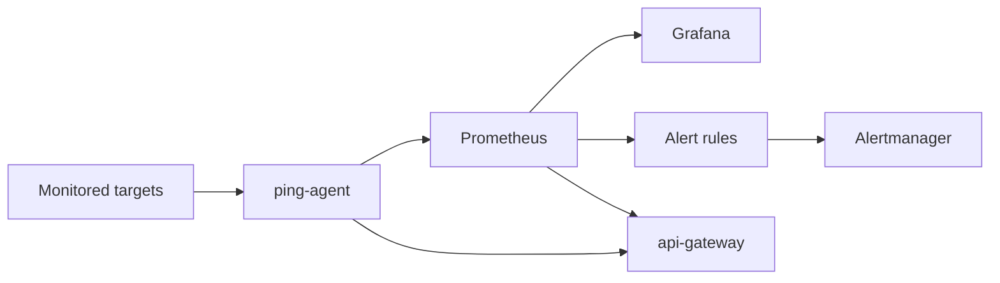

# Architecture

This repo has two runtime paths:

- Docker Compose for local proof and screenshots
- Helm for Kubernetes packaging and render checks

## Runtime flow

## Components

| Component | What it does | Main files |
|---|---|---|
| `ping-agent` | runs active checks and exposes metrics | `services/ping-agent/main.go` |
| `api-gateway` | exposes health, status, target, and uptime endpoints | `services/api-gateway/main.py` |
| Prometheus | scrapes metrics and evaluates rules | `config/prometheus.yml`, `config/alert.rules.yml` |
| Grafana | reads Prometheus and provisions the dashboard | `config/grafana-datasources.yml`, `config/grafana-dashboards.yml`, `monitoring/grafana-dashboard.json` |
| Alertmanager | receives alerts from Prometheus | `config/alertmanager.yml` |
| Helm chart | packages the stack for Kubernetes | `charts/iyup/` |

## Helm templates

The chart packages:

- `ping-agent`
- `api-gateway`
- Prometheus
- Grafana
- Alertmanager
- `alert-logger`
- optional ingress and HPA resources

The screenshot proof in this repo covers Docker Compose. The Helm side is render-validated, not cluster-validated.
